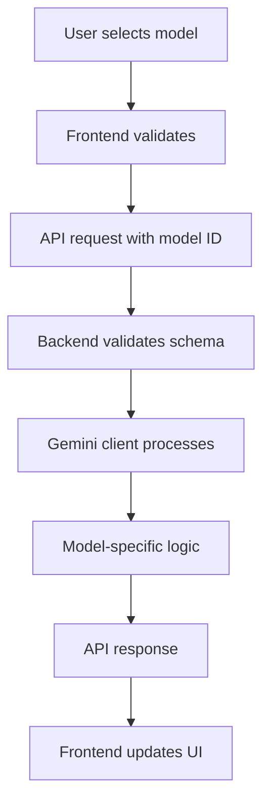

# Design Document

## Overview

This design addresses five critical issues in VibeBoard's AI model integration and UI functionality:

1. **Veo 3.1 Integration**: Add support for the latest Veo 3.1 video generation model
2. **Veo 2.0 Fix**: Correct API parameter handling to make Veo 2.0 functional
3. **Imagen 3 & 4 Fast Fix**: Enable Imagen 3 and Imagen 4 Fast models that are currently non-functional
4. **Settings Panel Navigation**: Fix settings selections in the global settings panel
5. **Group/Tag Visibility**: Ensure created groups and tags appear in the manager panel

The solution involves updates to type definitions, validation schemas, backend API logic, and frontend UI components.

## Architecture

### Component Hierarchy

```
Frontend (React + Zustand)
├── Settings Feature
│   ├── SettingsPanel (model selectors)
│   └── EnhancedSettingsSheet (tabbed interface)
├── Scene Feature
│   └── GroupsTagsInlineManagers (display groups/tags)
└── Generation Feature
    └── MediaService (API calls)

Backend (Express + SQLite)
├── Validation Layer (Zod schemas)
├── Routes Layer (AI endpoints)
└── Services Layer (Gemini client)
```

### Data Flow



## Components and Interfaces

### 1. Type Definitions (`src/types.ts`)

**Current State**: Missing Veo 3.1 in VideoModel type

**Changes Required**:
```typescript
export type VideoModel =
  | "veo-3.1-generate-001"  // ADD THIS
  | "veo-2.0-generate-001"
  | "veo-3.0-generate-001"
  | "veo-3.0-fast-generate-001";
```

**Rationale**: TypeScript types must match available models for type safety

### 2. Validation Schemas (`server/validation.ts`)

**Current State**: 
- Missing Veo 3.1 in videoModelSchema
- Imagen 3 and 4 Fast already present but may have incorrect identifiers

**Changes Required**:
```typescript
export const videoModelSchema = z.enum([
  "veo-3.1-generate-001",  // ADD THIS
  "veo-3.0-generate-001",
  "veo-3.0-fast-generate-001",
  "veo-2.0-generate-001",
] as const);

// Verify these are correct:
export const imageModelSchema = z.enum([
  "imagen-4.0-generate-001",
  "imagen-4.0-generate-001-fast",  // Verify this identifier
  "imagen-3.0-generate-001",
  "gemini-2.5-flash-image",
] as const);
```

**Rationale**: Backend validation must accept new model identifiers

### 3. Gemini Client Service (`server/services/geminiClient.ts`)

**Current State**: 
- Video generation logic exists but resolution handling is incorrect for Veo 2.0
- Image generation supports Imagen models but may have API call issues

**Changes Required**:

#### Video Generation Fix
```typescript
export const generateSceneVideo = async (
  image: { data: string; mimeType: string },
  prompt: string,
  model: string,
  aspectRatio: "16:9" | "9:16",
  resolution?: "1080p" | "720p"
): Promise<{ data: ArrayBuffer; mimeType: string }> => {
  const { client, apiKey } = ensureClient();

  // Model-specific resolution handling
  let finalResolution: "1080p" | "720p" | undefined;

  if (model === "veo-2.0-generate-001") {
    // Veo 2.0 does NOT support resolution parameter
    finalResolution = undefined;
  } else if (model === "veo-3.1-generate-001") {
    // Veo 3.1 supports 1080p for both aspect ratios
    finalResolution = resolution ?? "1080p";
  } else if (model === "veo-3.0-generate-001") {
    // Veo 3.0 supports 1080p for 16:9, 720p for 9:16
    if (aspectRatio === "16:9") {
      finalResolution = resolution ?? "1080p";
    } else {
      finalResolution = "720p";
    }
  } else {
    // Veo 3.0 Fast and future models
    finalResolution = resolution ?? "720p";
  }

  const config: any = {
    numberOfVideos: 1,
    quality: "hd",
    includePeople: true,
    safetySettings: [/* ... */],
  };

  // Only add resolution if model supports it
  if (finalResolution !== undefined) {
    config.resolution = finalResolution;
  }

  // Rest of implementation...
}
```

**Rationale**: 
- Veo 2.0 API rejects requests with resolution parameter
- Veo 3.1 has enhanced capabilities (1080p for all aspect ratios)
- Conditional parameter inclusion prevents API errors

#### Image Generation Verification
The current implementation appears correct. Issues may be:
1. **API endpoint changes**: Verify Imagen 3 uses `imagen-3.0-generate-001`
2. **API method**: Confirm `client.models.generateImages()` is correct
3. **Configuration parameters**: Check if Imagen 4 Fast requires different config

**Investigation needed**: Test actual API calls to identify failure points

### 4. Settings Panel UI (`src/features/settings/components/SettingsPanel.tsx`)

**Current State**: 
- Missing Veo 3.1 option
- Imagen 3 and 4 Fast options exist but may not be wired correctly

**Changes Required**:

```typescript
{/* Video Model Section */}
{allow("videoModel") && (
  <div>
    <h3 className="text-xs sm:text-sm font-semibold mb-2">
      Video Generation Model
    </h3>
    <div className="grid grid-cols-1 sm:grid-cols-2 gap-2">
      <ModelOption
        title="Veo 3.1"  // ADD THIS
        description="Latest generation, 1080p support."
        value="veo-3.1-generate-001"
        current={settings.videoModel}
        onClick={(v) =>
          onSettingsChange({
            videoModel: v as Settings["videoModel"],
          })
        }
      />
      <ModelOption
        title="Veo 3"
        description="High quality generation."
        value="veo-3.0-generate-001"
        current={settings.videoModel}
        onClick={(v) =>
          onSettingsChange({
            videoModel: v as Settings["videoModel"],
          })
        }
      />
      <ModelOption
        title="Veo 3 Fast"
        description="Optimized for speed."
        value="veo-3.0-fast-generate-001"
        current={settings.videoModel}
        onClick={(v) =>
          onSettingsChange({
            videoModel: v as Settings["videoModel"],
          })
        }
      />
      <ModelOption
        title="Veo 2"
        description="Proven quality."
        value="veo-2.0-generate-001"
        current={settings.videoModel}
        onClick={(v) =>
          onSettingsChange({
            videoModel: v as Settings["videoModel"],
          })
        }
      />
    </div>
  </div>
)}
```

**Rationale**: UI must expose all available models with clear descriptions

### 5. Enhanced Settings Sheet (`src/features/settings/components/EnhancedSettingsSheet.tsx`)

**Current State**: 
- Tab navigation works correctly
- Model selection buttons and other options are NOT responsive in global settings
- Only aspect ratio (in App tab) and thinking mode toggle (in Models tab) work
- Chat panel settings work fine (different component instance)

**Root Cause Analysis**:
The `EnhancedSettingsSheet` receives `onSettingsChange` as a prop and passes it to `SettingsPanel`. The issue is likely:
1. The `onSettingsChange` callback is not properly updating the parent state
2. The settings object is not being updated/re-rendered
3. Event propagation is being blocked somewhere in the component tree
4. The callback might be a no-op or not connected to the actual settings store

**Investigation Required**:
1. Trace where `EnhancedSettingsSheet` is rendered (likely in app-shell)
2. Check what `onSettingsChange` callback is passed
3. Verify the callback actually updates the settings store
4. Check if settings changes trigger re-renders

**Design Approach**:
The fix will likely be in the parent component that renders `EnhancedSettingsSheet`:

```typescript
// In the parent component (app-shell or similar)
const handleSettingsChange = (newSettings: Partial<Settings>) => {
  // This must actually update the store
  updateSettings(newSettings);
  // Or if using Zustand directly:
  useSettingsStore.getState().updateSettings(newSettings);
};

<EnhancedSettingsSheet
  settings={settings}
  onSettingsChange={handleSettingsChange}  // Must be properly wired
  // ... other props
/>
```

**Verification Steps**:
1. Add console.log in `onSettingsChange` to see if it's being called
2. Check if the callback updates the Zustand store
3. Verify the store update triggers a re-render
4. Compare with working chat panel settings implementation

### 6. Groups/Tags Manager Panel

**Current State**: 
- `GroupsTagsInlineManagers` component exists and looks correct
- Groups and tags are created but not displayed

**Investigation Required**:
1. Check where this component is rendered
2. Verify data flow from API to component
3. Check if groups/tags are being fetched on mount
4. Verify state management (Zustand store)

**Likely Issues**:
- Component not receiving updated data after creation
- Missing data fetch after create operation
- State not being updated in store
- Component not subscribed to correct store slice

**Design Approach**:
```typescript
// In the parent component that renders GroupsTagsInlineManagers
useEffect(() => {
  // Fetch groups and tags when component mounts
  fetchGroups();
  fetchTags();
}, [projectId]);

const handleCreateGroup = async (payload) => {
  await createGroup(payload);
  // Immediately refetch to show new group
  await fetchGroups();
};
```

## Data Models

### Video Model Configuration

```typescript
interface VideoModelConfig {
  id: string;
  displayName: string;
  description: string;
  supportsResolution: boolean;
  defaultResolution?: "1080p" | "720p";
  aspectRatioLimitations?: {
    "16:9": "1080p" | "720p";
    "9:16": "1080p" | "720p";
  };
}

const VIDEO_MODELS: Record<string, VideoModelConfig> = {
  "veo-3.1-generate-001": {
    id: "veo-3.1-generate-001",
    displayName: "Veo 3.1",
    description: "Latest generation, 1080p support for all ratios",
    supportsResolution: true,
    defaultResolution: "1080p",
  },
  "veo-3.0-generate-001": {
    id: "veo-3.0-generate-001",
    displayName: "Veo 3",
    description: "High quality generation",
    supportsResolution: true,
    aspectRatioLimitations: {
      "16:9": "1080p",
      "9:16": "720p",
    },
  },
  "veo-2.0-generate-001": {
    id: "veo-2.0-generate-001",
    displayName: "Veo 2",
    description: "Proven quality",
    supportsResolution: false,
  },
};
```

## Error Handling

### Video Generation Errors

**Veo 2.0 Specific**:
- Error: "Invalid parameter: resolution"
- Solution: Omit resolution from config
- User message: "Generating video with Veo 2.0..."

**Veo 3.1 Specific**:
- Error: "Model not found"
- Solution: Verify model ID is correct
- User message: "Veo 3.1 is not available. Please try another model."

### Image Generation Errors

**Imagen 3/4 Fast Specific**:
- Error: "Model not found" or "Invalid model identifier"
- Investigation: Check actual API model IDs
- Potential fix: Update model identifiers in schema
- User message: "Image generation failed. Please try another model."

### Settings Panel Errors

**Tab Navigation**:
- Error: Tabs not responding to clicks
- Solution: Ensure event handlers are attached
- Fallback: Display all settings in single view if tabs fail

### Groups/Tags Display Errors

**Data Not Showing**:
- Error: Groups/tags created but not visible
- Solution: Trigger refetch after mutations
- Fallback: Show refresh button if auto-update fails

## Testing Strategy

### Unit Tests

1. **Type Validation**
   - Test videoModelSchema accepts all valid models
   - Test imageModelSchema accepts all valid models
   - Test invalid models are rejected

2. **Resolution Logic**
   - Test Veo 2.0 config omits resolution
   - Test Veo 3.1 config includes 1080p
   - Test Veo 3.0 respects aspect ratio limitations

3. **UI Component Rendering**
   - Test all model options render in SettingsPanel
   - Test model selection updates settings state
   - Test tab navigation in EnhancedSettingsSheet

### Integration Tests

1. **Video Generation Flow**
   - Test Veo 2.0 generates video without errors
   - Test Veo 3.1 generates video with 1080p
   - Test video asset is persisted to database

2. **Image Generation Flow**
   - Test Imagen 3 generates image
   - Test Imagen 4 Fast generates image
   - Test image asset is persisted to database

3. **Settings Persistence**
   - Test model selection is saved
   - Test settings persist across page refresh
   - Test settings sync between components

4. **Groups/Tags Management**
   - Test group creation shows in manager
   - Test tag creation shows in manager
   - Test deletion removes from display

### Manual Testing Checklist

- [ ] Select Veo 3.1 in settings
- [ ] Generate video with Veo 3.1
- [ ] Verify video quality is 1080p
- [ ] Select Veo 2.0 in settings
- [ ] Generate video with Veo 2.0 (should work)
- [ ] Select Imagen 3 in settings
- [ ] Generate image with Imagen 3
- [ ] Select Imagen 4 Fast in settings
- [ ] Generate image with Imagen 4 Fast
- [ ] Open settings panel
- [ ] Click between App Settings and Model Settings tabs
- [ ] Verify tab content changes
- [ ] Create a new group
- [ ] Verify group appears in manager panel
- [ ] Create a new tag
- [ ] Verify tag appears in manager panel
- [ ] Delete group/tag
- [ ] Verify removal from manager panel

## Implementation Notes

### Priority Order

1. **High Priority** (Blocking user workflows):
   - Fix Veo 2.0 (users cannot generate videos)
   - Fix global settings panel model selection (users cannot change models in global settings)

2. **Medium Priority** (New features):
   - Add Veo 3.1 support
   - Fix Imagen 3/4 Fast (if they're actually broken)

3. **Low Priority** (UX improvements):
   - Fix groups/tags visibility (workaround: refresh page)

### Rollback Strategy

If issues arise:
1. Revert type changes in `src/types.ts`
2. Revert validation schema in `server/validation.ts`
3. Revert Gemini client changes
4. Restart server to clear cached modules

### Performance Considerations

- Model selection changes are instant (no API calls)
- Video generation with Veo 3.1 may take longer (higher quality)
- Groups/tags refetch should be debounced if causing performance issues

### Security Considerations

- All model IDs are validated server-side
- No user input directly passed to Gemini API
- API keys remain server-side only

## Dependencies

### External APIs
- Google Gemini API (@google/genai SDK)
- Veo 2.0, 3.0, 3.1 video generation endpoints
- Imagen 3, 4 Fast image generation endpoints

### Internal Dependencies
- Zustand stores for state management
- Zod for validation
- React for UI components
- Express for API routing

## Migration Path

No database migrations required. Changes are code-only:
1. Update type definitions
2. Update validation schemas
3. Update backend logic
4. Update frontend UI
5. Test each model individually
6. Deploy and monitor error logs
