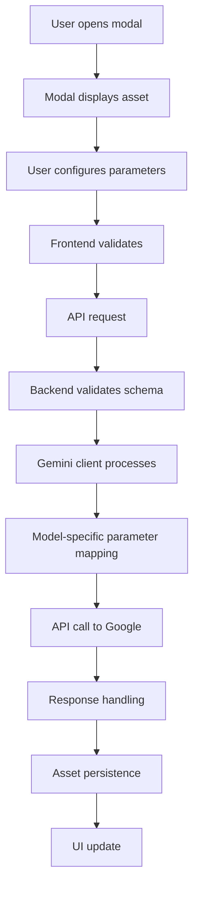

# Design Document

## Overview

This design enhances StoryBoard's video generation capabilities by:

1. **Fixing Veo 3.1 aspect ratio bug** - ensuring 16:9 stays 16:9 and 9:16 stays 9:16
2. **Adding video extension** - extending existing videos with new AI-generated content
3. **Exposing resolution controls** - letting users choose between 1080p and 720p
4. **Supporting advanced Veo 3.1 parameters** - reference images and last frame interpolation
5. **Redesigning edit/animate/extend UI** - moving from inline panels to focused modal dialogs
6. **Validating API parameters** - ensuring all parameters match Google's official documentation

The solution involves backend API parameter fixes, new video extension endpoints, modal-based UI components, and comprehensive parameter validation.

## Architecture

### Component Hierarchy

```,
Frontend (React + Zustand)
├── Settings Feature
│   └── SettingsPanel (resolution selector)
├── Storyboard Feature
│   ├── SceneCard (action buttons)
│   ├── EditModal (new)
│   ├── AnimateModal (new)
│   └── ExtendModal (new)
└── Generation Feature
    └── MediaService (API calls)

Backend (Express + SQLite)
├── Validation Layer (Zod schemas)
├── Routes Layer (AI endpoints)
│   ├── /api/ai/video (image-to-video)
│   └── /api/ai/video/extend (new)
└── Services Layer (Gemini client)
```

### Data Flow



## Components and Interfaces

### 1. Backend: Fix Aspect Ratio Parameter

**Current Issue**: The `generateSceneVideo` function in `server/services/geminiClient.ts` correctly sets `aspectRatio` in the config, but there may be a mismatch in how it's being passed or the API is interpreting it.

**Investigation Required**:

- Verify the exact parameter name expected by Veo 3.1 API
- Check if aspect ratio needs to be passed differently for different models
- Confirm the API response includes aspect ratio metadata

**Changes Required**:

```typescript
// In server/services/geminiClient.ts
export const generateSceneVideo = async (
  image: { data: string; mimeType: string },
  prompt: string,
  model: string,
  aspectRatio: "16:9" | "9:16",
  resolution?: "1080p" | "720p"
): Promise<{ data: ArrayBuffer; mimeType: string; metadata?: any }> => {
  // ... existing code ...

  const config: any = {
    numberOfVideos: 1,
    aspectRatio: aspectRatio, // Ensure this is being set correctly
    quality: "hd",
    includePeople: true,
    safetySettings: [/* ... */],
  };

  // Add resolution for models that support it
  if (finalResolution) {
    config.resolution = finalResolution;
  }

  // Log for debugging
  console.log(`Video generation config:`, {
    model,
    aspectRatio,
    resolution: finalResolution,
  });

  // ... rest of implementation ...

  // Return metadata for verification
  return {
    data: buffer,
    mimeType,
    metadata: {
      requestedAspectRatio: aspectRatio,
      requestedResolution: finalResolution,
    },
  };
};
```

**Rationale**: Adding logging and metadata will help diagnose if the issue is in our request or the API response.

### 2. Backend: Add Resolution to Settings

**Current State**: Resolution parameter exists in `aiGenerateVideoSchema` but isn't exposed in settings UI.

**Changes Required**:

```typescript
// In src/types.ts
export interface Settings {
  sceneCount: number;
  chatModel: ChatModel;
  imageModel: ImageModel;
  videoModel: VideoModel;
  workflow: WorkflowKey;
  videoAutoplay: "never" | "on-generate";
  videoResolution: "1080p" | "720p"; // ADD THIS
  aspectRatio: "16:9" | "9:16";
}

// In server/validation.ts - already has resolution in aiGenerateVideoSchema
// Just need to add to settings schema:
export const upsertSettingsSchema = z.object({
  data: z
    .object({
      sceneCount: z.number().int().positive().max(20).optional(),
      chatModel: chatModelSchema.optional(),
      imageModel: imageModelSchema.optional(),
      videoModel: videoModelSchema.optional(),
      workflow: workflowSchema.optional(),
      videoAutoplay: videoAutoplaySchema.optional(),
      videoResolution: z.enum(["1080p", "720p"] as const).optional(), // ADD THIS
    })
    .passthrough(),
});
```

**Rationale**: Resolution should be a persistent setting like other model parameters.

### 3. Backend: Video Extension Endpoint

**New Endpoint**: `POST /api/ai/video/extend`

**Schema**:

```typescript
// In server/validation.ts
export const aiExtendVideoSchema = z.object({
  projectId: z.string().min(1),
  sceneId: z.string().min(1),
  prompt: z.string().min(1),
  model: videoModelSchema.default("veo-3.1-generate-preview"),
  extensionCount: z.number().int().min(1).max(20).default(1),
  // Video extension constraints per API docs:
  // - Each extension adds 7 seconds
  // - Can extend up to 20 times
  // - Only supports 720p
  // - Supports both 16:9 and 9:16
  // - Input video must be Veo-generated and ≤141 seconds
  // - Output video will be ≤141 seconds (141 + 7)
});
```

**Implementation**:

```typescript
// In server/routes/ai.ts
router.post("/video/extend", (req, res) => {
  void handle(req, res, "/api/ai/video/extend", async (setMeta) => {
    const data = aiExtendVideoSchema.parse(req.body);
    setMeta({
      projectId: data.projectId,
      geminiModel: data.model,
      prompt: data.prompt,
    });

    requireProject(db, data.projectId);
    const scene = requireScene(db, data.projectId, data.sceneId);
    
    if (!scene.primaryVideoAssetId) {
      throw Object.assign(
        new Error("Scene requires a video before extending."),
        {
          statusCode: 400,
          errorCode: "SCENE_VIDEO_MISSING",
          retryable: false,
        }
      );
    }

    const asset = getAssetById(db, scene.primaryVideoAssetId);
    if (!asset) {
      throw Object.assign(new Error("Video asset not found."), {
        statusCode: 404,
        errorCode: "VIDEO_ASSET_NOT_FOUND",
      });
    }

    // Validate video length
    const videoDuration = asset.metadata?.duration || 0;
    const maxExtensions = Math.floor((141 - videoDuration) / 7);
    
    if (data.extensionCount > maxExtensions) {
      throw Object.assign(
        new Error(`Video can only be extended ${maxExtensions} more times (current: ${videoDuration}s, max: 141s)`),
        {
          statusCode: 400,
          errorCode: "EXTENSION_LIMIT_EXCEEDED",
          retryable: false,
        }
      );
    }

    const { base64, mimeType } = readAssetBase64(asset.filePath);
    const extendedVideo = await extendSceneVideo(
      { data: base64, mimeType },
      data.prompt,
      data.model,
      scene.aspectRatio,
      data.extensionCount
    );

    const buffer = Buffer.from(extendedVideo.data);
    const { asset: newAsset } = persistAssetBuffer({
      db,
      config,
      projectId: data.projectId,
      sceneId: data.sceneId,
      type: "video",
      mimeType: extendedVideo.mimeType,
      buffer,
      metadata: {
        source: "ai-video-extension",
        prompt: data.prompt,
        model: data.model,
        extendedFrom: asset.id,
        extensionCount: data.extensionCount,
        duration: videoDuration + (data.extensionCount * 7),
      },
    });

    const updatedScene = requireScene(db, data.projectId, data.sceneId);
    const enriched = enrichSceneWithAssets(db, updatedScene);
    
    return {
      asset: { id: newAsset.id },
      url: enriched.videoUrl,
      scene: enriched,
    };
  });
});
```

**Rationale**: Video extension is a separate operation from image-to-video, requiring different parameters and constraints.

### 4. Backend: Video Extension Service

**New Function**: `extendSceneVideo` in `server/services/geminiClient.ts`

```typescript
export const extendSceneVideo = async (
  video: { data: string; mimeType: string },
  prompt: string,
  model: string,
  aspectRatio: "16:9" | "9:16",
  extensionCount: number = 1
): Promise<{ data: ArrayBuffer; mimeType: string }> => {
  const { client, apiKey } = ensureClient();

  // Video extension constraints per Veo 3.1 API docs:
  // - Each extension adds 7 seconds
  // - Can extend up to 20 times in a row
  // - Resolution: only 720p supported
  // - Aspect ratio: both 16:9 and 9:16 supported
  // - Person generation: "allow_all" only
  // - Output is a single combined video (input + all extensions)

  let currentVideo = video;

  // Extend the video multiple times if requested
  for (let i = 0; i < extensionCount; i++) {
    const config: any = {
      numberOfVideos: 1,
      aspectRatio: aspectRatio,
      resolution: "720p", // Only 720p supported for extension
      quality: "hd",
      includePeople: true,
      personGeneration: "allow_all", // Required for extension
      safetySettings: [
        {
          category: HarmCategory.HARM_CATEGORY_HARASSMENT,
          threshold: HarmBlockThreshold.BLOCK_NONE,
        },
        {
          category: HarmCategory.HARM_CATEGORY_HATE_SPEECH,
          threshold: HarmBlockThreshold.BLOCK_NONE,
        },
        {
          category: HarmCategory.HARM_CATEGORY_SEXUALLY_EXPLICIT,
          threshold: HarmBlockThreshold.BLOCK_NONE,
        },
        {
          category: HarmCategory.HARM_CATEGORY_DANGEROUS_CONTENT,
          threshold: HarmBlockThreshold.BLOCK_NONE,
        },
      ],
    };

    let operation = await client.models.generateVideos({
      model,
      prompt,
      video: {
        videoBytes: currentVideo.data,
        mimeType: currentVideo.mimeType,
      },
      config,
    });

    while (!operation.done) {
      await new Promise((resolve) => setTimeout(resolve, 10_000));
      operation = await client.operations.getVideosOperation({ operation });
    }

    const downloadLink = operation.response?.generatedVideos?.[0]?.video?.uri;
    if (!downloadLink) {
      throw new Error(`Video extension ${i + 1}/${extensionCount} did not return a download link.`);
    }

    const response = await fetch(`${downloadLink}&key=${apiKey}`);
    if (!response.ok) {
      throw new Error(`Failed to download extended video ${i + 1}/${extensionCount}: ${response.statusText}`);
    }

    const mimeType = response.headers.get("content-type") ?? "video/mp4";
    const buffer = await response.arrayBuffer();
    
    // Use the extended video as input for the next extension
    currentVideo = {
      data: Buffer.from(buffer).toString("base64"),
      mimeType,
    };
  }

  // Return the final extended video
  return {
    data: Buffer.from(currentVideo.data, "base64").buffer as ArrayBuffer,
    mimeType: currentVideo.mimeType,
  };
};
```

**Rationale**: Video extension uses the `video` parameter instead of `image`, with specific constraints per API documentation.

### 5. Backend: Reference Images Support

**Update**: Modify `generateSceneVideo` to accept optional reference images

```typescript
export const generateSceneVideo = async (
  image: { data: string; mimeType: string },
  prompt: string,
  model: string,
  aspectRatio: "16:9" | "9:16",
  resolution?: "1080p" | "720p",
  referenceImages?: Array<{ data: string; mimeType: string }>,
  lastFrame?: { data: string; mimeType: string }
): Promise<{ data: ArrayBuffer; mimeType: string }> => {
  const { client, apiKey } = ensureClient();

  // Determine resolution based on model and constraints
  let finalResolution: "1080p" | "720p" | undefined;
  let finalDuration: number = 6; // Default duration

  if (model === "veo-2.0-generate-001") {
    finalResolution = undefined;
  } else if (
    model === "veo-3.1-generate-preview" ||
    model === "veo-3.1-fast-generate-preview"
  ) {
    // Veo 3.1 constraints:
    // - With referenceImages: must be 8s duration, 16:9 aspect ratio only
    // - With lastFrame: must be 8s duration, supports both aspect ratios
    // - Normal: supports 1080p for both aspect ratios
    
    if (referenceImages && referenceImages.length > 0) {
      if (aspectRatio !== "16:9") {
        throw new Error("Reference images only support 16:9 aspect ratio");
      }
      finalDuration = 8;
      finalResolution = resolution ?? "1080p";
    } else if (lastFrame) {
      finalDuration = 8;
      finalResolution = resolution ?? "1080p";
    } else {
      finalResolution = resolution ?? "1080p";
    }
  } else if (model === "veo-3.0-generate-001") {
    if (aspectRatio === "16:9") {
      finalResolution = resolution ?? "1080p";
    } else {
      finalResolution = "720p";
    }
  } else {
    finalResolution = resolution ?? "720p";
  }

  const config: any = {
    numberOfVideos: 1,
    aspectRatio: aspectRatio,
    durationSeconds: finalDuration,
    quality: "hd",
    includePeople: true,
    safetySettings: [/* ... */],
  };

  if (finalResolution) {
    config.resolution = finalResolution;
  }

  // Add reference images if provided (Veo 3.1 only)
  if (referenceImages && referenceImages.length > 0) {
    if (referenceImages.length > 3) {
      throw new Error("Maximum 3 reference images allowed");
    }
    config.referenceImages = referenceImages.map(img => ({
      imageBytes: img.data,
      mimeType: img.mimeType,
    }));
    config.personGeneration = "allow_adult"; // Required for reference images
  }

  // Add last frame if provided
  if (lastFrame) {
    config.lastFrame = {
      imageBytes: lastFrame.data,
      mimeType: lastFrame.mimeType,
    };
    config.personGeneration = "allow_adult"; // Required for interpolation
  }

  let operation = await client.models.generateVideos({
    model,
    prompt,
    image: {
      imageBytes: image.data,
      mimeType: image.mimeType,
    },
    config,
  });

  // ... rest of implementation ...
};
```

**Rationale**: Reference images and last frame are Veo 3.1-specific features with specific constraints per API documentation.

### 6. Frontend: Resolution Settings UI

**Update**: `src/features/settings/components/SettingsPanel.tsx`

```typescript
{/* Resolution Section - add after aspect ratio */}
{allow("videoResolution") && (
  <div>
    <h3 className="text-xs sm:text-sm font-semibold mb-2">
      Video Resolution
    </h3>
    <div className="grid grid-cols-2 gap-2">
      <ModelOption
        title="1080p"
        description="High quality (default)"
        value="1080p"
        current={settings.videoResolution}
        onClick={(v) =>
          onSettingsChange({
            videoResolution: v as Settings["videoResolution"],
          })
        }
      />
      <ModelOption
        title="720p"
        description="Faster generation"
        value="720p"
        current={settings.videoResolution}
        onClick={(v) =>
          onSettingsChange({
            videoResolution: v as Settings["videoResolution"],
          })
        }
      />
    </div>
    <p className="text-xs text-muted mt-2">
      Note: Video extension only supports 720p. Veo 2.0 ignores resolution setting.
    </p>
  </div>
)}
```

**Rationale**: Users need visibility and control over resolution to balance quality vs speed.

### 7. Frontend: Modal Components

**New Component**: `src/features/storyboard/components/EditModal.tsx`

```typescript
import React, { useState } from "react";
import { X } from "lucide-react";
import { Scene } from "@/types";

interface EditModalProps {
  scene: Scene;
  isOpen: boolean;
  onClose: () => void;
  onSubmit: (sceneId: string, prompt: string) => void;
  onSuggestPrompt: (sceneId: string) => Promise<string | null>;
  isBusy: boolean;
}

export const EditModal: React.FC<EditModalProps> = ({
  scene,
  isOpen,
  onClose,
  onSubmit,
  onSuggestPrompt,
  isBusy,
}) => {
  const [prompt, setPrompt] = useState("");
  const [isSuggesting, setIsSuggesting] = useState(false);

  if (!isOpen) return null;

  const handleSubmit = (e: React.FormEvent) => {
    e.preventDefault();
    if (!prompt.trim() || isBusy) return;
    onSubmit(scene.id, prompt.trim());
  };

  const handleSuggest = async () => {
    setIsSuggesting(true);
    try {
      const suggested = await onSuggestPrompt(scene.id);
      if (suggested) {
        setPrompt(suggested);
      }
    } catch (error) {
      console.error("Failed to suggest prompt", error);
    } finally {
      setIsSuggesting(false);
    }
  };

  return (
    <div className="modal-overlay" onClick={onClose}>
      <div
        className="modal-content modal-centered"
        onClick={(e) => e.stopPropagation()}
      >
        <div className="modal-header">
          <h2 className="text-lg font-semibold">Edit Scene Image</h2>
          <button
            type="button"
            onClick={onClose}
            className="icon-btn-overlay"
            aria-label="Close"
          >
            <X className="icon-md" />
          </button>
        </div>

        <div className="modal-body">
          {/* Display current image */}
          {scene.imageUrl && (
            <div className="mb-4">
              
            </div>
          )}

          {/* Scene description */}
          <div className="mb-4">
            <p className="text-sm text-muted">{scene.description}</p>
          </div>

          {/* Prompt input */}
          <form onSubmit={handleSubmit}>
            <textarea
              value={prompt}
              onChange={(e) => setPrompt(e.target.value)}
              placeholder="Describe your edits..."
              className="w-full h-32 px-3 py-2 rounded-lg text-sm resize-none"
              style={{
                backgroundColor: "var(--card-bg)",
                color: "var(--text-primary)",
                borderColor: "var(--card-border)",
              }}
            />

            <div className="flex gap-2 mt-4">
              <button
                type="button"
                onClick={handleSuggest}
                disabled={isSuggesting || isBusy}
                className="btn-base btn-soft-primary flex-1"
              >
                {isSuggesting ? "Suggesting..." : "AI Suggest"}
              </button>
              <button
                type="submit"
                disabled={!prompt.trim() || isBusy}
                className="btn-base btn-primary flex-1"
              >
                {isBusy ? "Generating..." : "Generate"}
              </button>
            </div>
          </form>
        </div>
      </div>
    </div>
  );
};
```

**New Component**: `src/features/storyboard/components/AnimateModal.tsx`

```typescript
import React, { useState } from "react";
import { X, Upload } from "lucide-react";
import { Scene } from "@/types";

interface AnimateModalProps {
  scene: Scene;
  isOpen: boolean;
  onClose: () => void;
  onSubmit: (
    sceneId: string,
    prompt: string,
    referenceImages?: File[],
    lastFrame?: File
  ) => void;
  onSuggestPrompt: (sceneId: string) => Promise<string | null>;
  isBusy: boolean;
}

export const AnimateModal: React.FC<AnimateModalProps> = ({
  scene,
  isOpen,
  onClose,
  onSubmit,
  onSuggestPrompt,
  isBusy,
}) => {
  const [prompt, setPrompt] = useState("");
  const [isSuggesting, setIsSuggesting] = useState(false);
  const [referenceImages, setReferenceImages] = useState<File[]>([]);
  const [lastFrame, setLastFrame] = useState<File | null>(null);

  if (!isOpen) return null;

  const handleSubmit = (e: React.FormEvent) => {
    e.preventDefault();
    if (isBusy) return;
    const finalPrompt = prompt.trim() || scene.description;
    onSubmit(scene.id, finalPrompt, referenceImages, lastFrame ?? undefined);
  };

  const handleSuggest = async () => {
    setIsSuggesting(true);
    try {
      const suggested = await onSuggestPrompt(scene.id);
      if (suggested) {
        setPrompt(suggested);
      }
    } catch (error) {
      console.error("Failed to suggest prompt", error);
    } finally {
      setIsSuggesting(false);
    }
  };

  const handleReferenceUpload = (e: React.ChangeEvent<HTMLInputElement>) => {
    const files = Array.from(e.target.files || []);
    if (referenceImages.length + files.length > 3) {
      alert("Maximum 3 reference images allowed");
      return;
    }
    setReferenceImages([...referenceImages, ...files]);
  };

  const handleLastFrameUpload = (e: React.ChangeEvent<HTMLInputElement>) => {
    const file = e.target.files?.[0];
    if (file) {
      setLastFrame(file);
    }
  };

  return (
    <div className="modal-overlay" onClick={onClose}>
      <div
        className="modal-content modal-centered"
        onClick={(e) => e.stopPropagation()}
      >
        <div className="modal-header">
          <h2 className="text-lg font-semibold">Animate Scene</h2>
          <button
            type="button"
            onClick={onClose}
            className="icon-btn-overlay"
            aria-label="Close"
          >
            <X className="icon-md" />
          </button>
        </div>

        <div className="modal-body">
          {/* Display current image */}
          {scene.imageUrl && (
            <div className="mb-4">
              
            </div>
          )}

          {/* Scene description */}
          <div className="mb-4">
            <p className="text-sm text-muted">{scene.description}</p>
          </div>

          {/* Prompt input */}
          <form onSubmit={handleSubmit}>
            <textarea
              value={prompt}
              onChange={(e) => setPrompt(e.target.value)}
              placeholder="Describe the animation... (optional, will use scene description)"
              className="w-full h-32 px-3 py-2 rounded-lg text-sm resize-none mb-4"
              style={{
                backgroundColor: "var(--card-bg)",
                color: "var(--text-primary)",
                borderColor: "var(--card-border)",
              }}
            />

            {/* Advanced options */}
            <div className="space-y-3 mb-4">
              {/* Reference images */}
              <div>
                <label className="text-sm font-medium mb-2 block">
                  Reference Images (optional, max 3)
                </label>
                <input
                  type="file"
                  accept="image/*"
                  multiple
                  onChange={handleReferenceUpload}
                  className="hidden"
                  id="ref-images"
                />
                <label
                  htmlFor="ref-images"
                  className="btn-base btn-soft-primary cursor-pointer inline-flex items-center gap-2"
                >
                  <Upload className="icon-sm" />
                  Upload References ({referenceImages.length}/3)
                </label>
                {referenceImages.length > 0 && (
                  <div className="mt-2 flex gap-2">
                    {referenceImages.map((file, idx) => (
                      <div key={idx} className="relative">
                        
                        <button
                          type="button"
                          onClick={() =>
                            setReferenceImages(
                              referenceImages.filter((_, i) => i !== idx)
                            )
                          }
                          className="absolute -top-1 -right-1 bg-red-500 text-white rounded-full p-0.5"
                        >
                          <X className="w-3 h-3" />
                        </button>
                      </div>
                    ))}
                  </div>
                )}
              </div>

              {/* Last frame */}
              <div>
                <label className="text-sm font-medium mb-2 block">
                  Last Frame (optional, for interpolation)
                </label>
                <input
                  type="file"
                  accept="image/*"
                  onChange={handleLastFrameUpload}
                  className="hidden"
                  id="last-frame"
                />
                <label
                  htmlFor="last-frame"
                  className="btn-base btn-soft-primary cursor-pointer inline-flex items-center gap-2"
                >
                  <Upload className="icon-sm" />
                  {lastFrame ? "Change Last Frame" : "Upload Last Frame"}
                </label>
                {lastFrame && (
                  <div className="mt-2 relative inline-block">
                    
                    <button
                      type="button"
                      onClick={() => setLastFrame(null)}
                      className="absolute -top-1 -right-1 bg-red-500 text-white rounded-full p-0.5"
                    >
                      <X className="w-3 h-3" />
                    </button>
                  </div>
                )}
              </div>
            </div>

            <div className="flex gap-2">
              <button
                type="button"
                onClick={handleSuggest}
                disabled={isSuggesting || isBusy}
                className="btn-base btn-soft-primary flex-1"
              >
                {isSuggesting ? "Suggesting..." : "AI Suggest"}
              </button>
              <button
                type="submit"
                disabled={isBusy}
                className="btn-base btn-primary flex-1"
              >
                {isBusy ? "Generating..." : "Generate Video"}
              </button>
            </div>
          </form>
        </div>
      </div>
    </div>
  );
};
```

**New Component**: `src/features/storyboard/components/ExtendModal.tsx`

```typescript
import React, { useState } from "react";
import { X } from "lucide-react";
import { Scene } from "@/types";

interface ExtendModalProps {
  scene: Scene;
  isOpen: boolean;
  onClose: () => void;
  onSubmit: (sceneId: string, prompt: string, extensionCount: number) => void;
  isBusy: boolean;
}

export const ExtendModal: React.FC<ExtendModalProps> = ({
  scene,
  isOpen,
  onClose,
  onSubmit,
  isBusy,
}) => {
  const [prompt, setPrompt] = useState("");
  const [extensionCount, setExtensionCount] = useState(1);

  if (!isOpen) return null;

  // Calculate current video duration and max extensions
  const currentDuration = scene.metadata?.duration || 0;
  const maxExtensions = Math.min(20, Math.floor((141 - currentDuration) / 7));
  const finalDuration = currentDuration + (extensionCount * 7);

  const handleSubmit = (e: React.FormEvent) => {
    e.preventDefault();
    if (!prompt.trim() || isBusy) return;
    onSubmit(scene.id, prompt.trim(), extensionCount);
  };

  return (
    <div className="modal-overlay" onClick={onClose}>
      <div
        className="modal-content modal-centered"
        onClick={(e) => e.stopPropagation()}
      >
        <div className="modal-header">
          <h2 className="text-lg font-semibold">Extend Video</h2>
          <button
            type="button"
            onClick={onClose}
            className="icon-btn-overlay"
            aria-label="Close"
          >
            <X className="icon-md" />
          </button>
        </div>

        <div className="modal-body">
          {/* Display current video */}
          {scene.videoUrl && (
            <div className="mb-4">
              <video
                src={scene.videoUrl}
                controls
                className="w-full rounded-lg"
              />
            </div>
          )}

          {/* Scene description */}
          <div className="mb-4">
            <p className="text-sm text-muted">{scene.description}</p>
          </div>

          {/* Info about constraints */}
          <div className="mb-4 p-3 rounded-lg bg-blue-500/10 border border-blue-500/20">
            <p className="text-xs text-blue-400">
              Current: {currentDuration}s | Each extension adds 7s | Max: 141s total
            </p>
          </div>

          {/* Extension count selector */}
          <div className="mb-4">
            <label className="text-sm font-medium mb-2 block">
              Number of Extensions (1-{maxExtensions})
            </label>
            <input
              type="range"
              min="1"
              max={maxExtensions}
              value={extensionCount}
              onChange={(e) => setExtensionCount(parseInt(e.target.value))}
              className="w-full"
            />
            <div className="flex justify-between text-xs text-muted mt-1">
              <span>{extensionCount} extension{extensionCount > 1 ? 's' : ''}</span>
              <span>Final: {finalDuration}s</span>
            </div>
          </div>

          {/* Prompt input */}
          <form onSubmit={handleSubmit}>
            <textarea
              value={prompt}
              onChange={(e) => setPrompt(e.target.value)}
              placeholder="Describe what happens next..."
              className="w-full h-32 px-3 py-2 rounded-lg text-sm resize-none"
              style={{
                backgroundColor: "var(--card-bg)",
                color: "var(--text-primary)",
                borderColor: "var(--card-border)",
              }}
            />

            <div className="flex gap-2 mt-4">
              <button
                type="button"
                onClick={onClose}
                className="btn-base btn-soft-primary flex-1"
              >
                Cancel
              </button>
              <button
                type="submit"
                disabled={!prompt.trim() || isBusy}
                className="btn-base btn-primary flex-1"
              >
                {isBusy ? "Extending..." : "Extend Video"}
              </button>
            </div>
          </form>
        </div>
      </div>
    </div>
  );
};
```

**Rationale**: Modal-based UI provides better context by showing the asset being modified, and allows for more complex interactions like file uploads without cluttering the scene card.

### 8. Frontend: Update SceneCard

**Changes Required**: Replace inline panel toggles with modal opens

```typescript
// In src/features/storyboard/components/SceneCard.tsx

// Remove these states:
// const [isEditPanelOpen, setIsEditPanelOpen] = React.useState(false);
// const [isAnimatePanelOpen, setIsAnimatePanelOpen] = React.useState(false);

// Update menu items to open modals instead:
<button
  type="button"
  onClick={() => {
    setMenuOpen(false);
    onToggleEdit(scene.id); // This will now open modal
  }}
  className="menu-item flex items-center"
  role="menuitem"
>
  <Pencil className="icon-sm mr-2" /> Edit
</button>

<button
  type="button"
  onClick={() => {
    setMenuOpen(false);
    onToggleAnimate(scene.id); // This will now open modal
  }}
  className="menu-item flex items-center"
  role="menuitem"
>
  <Film className="icon-sm mr-2" /> Animate
</button>

// Add new extend button (only show if video exists):
{scene.videoUrl && (
  <button
    type="button"
    onClick={() => {
      setMenuOpen(false);
      onToggleExtend(scene.id); // New callback
    }}
    className="menu-item flex items-center"
    role="menuitem"
  >
    <Film className="icon-sm mr-2" /> Extend
  </button>
)}

// Remove inline panel renders:
// {isEditPanelOpen && <SceneEditPanel ... />}
// {isAnimatePanelOpen && <SceneAnimatePanel ... />}
```

**Rationale**: Simplifies SceneCard by removing inline panel state management and rendering.

### 9. Frontend: Modal State Management

**Update**: Parent component (StoryboardPanel or similar) manages modal state

```typescript
// In parent component
const [editModalScene, setEditModalScene] = useState<Scene | null>(null);
const [animateModalScene, setAnimateModalScene] = useState<Scene | null>(null);
const [extendModalScene, setExtendModalScene] = useState<Scene | null>(null);

const handleToggleEdit = (sceneId: string) => {
  const scene = scenes.find(s => s.id === sceneId);
  setEditModalScene(scene ?? null);
};

const handleToggleAnimate = (sceneId: string) => {
  const scene = scenes.find(s => s.id === sceneId);
  setAnimateModalScene(scene ?? null);
};

const handleToggleExtend = (sceneId: string) => {
  const scene = scenes.find(s => s.id === sceneId);
  setExtendModalScene(scene ?? null);
};

// Render modals at parent level
return (
  <>
    {/* Scene cards */}
    {scenes.map(scene => (
      <SceneCard
        key={scene.id}
        scene={scene}
        onToggleEdit={handleToggleEdit}
        onToggleAnimate={handleToggleAnimate}
        onToggleExtend={handleToggleExtend}
        // ... other props
      />
    ))}

    {/* Modals */}
    {editModalScene && (
      <EditModal
        scene={editModalScene}
        isOpen={true}
        onClose={() => setEditModalScene(null)}
        onSubmit={handleEditSubmit}
        onSuggestPrompt={handleSuggestEditPrompt}
        isBusy={isEditBusy}
      />
    )}

    {animateModalScene && (
      <AnimateModal
        scene={animateModalScene}
        isOpen={true}
        onClose={() => setAnimateModalScene(null)}
        onSubmit={handleAnimateSubmit}
        onSuggestPrompt={handleSuggestVideoPrompt}
        isBusy={isAnimateBusy}
      />
    )}

    {extendModalScene && (
      <ExtendModal
        scene={extendModalScene}
        isOpen={true}
        onClose={() => setExtendModalScene(null)}
        onSubmit={handleExtendSubmit}
        isBusy={isExtendBusy}
      />
    )}
  </>
);
```

**Rationale**: Centralizing modal state at parent level simplifies state management and ensures only one modal is open at a time.

## Data Models

### Video Generation Request

```typescript
interface VideoGenerationRequest {
  projectId: string;
  sceneId: string;
  prompt: string;
  model: VideoModel;
  aspectRatio: "16:9" | "9:16";
  resolution?: "1080p" | "720p";
  referenceImages?: Array<{ data: string; mimeType: string }>;
  lastFrame?: { data: string; mimeType: string };
}
```

### Video Extension Request

```typescript
interface VideoExtensionRequest {
  projectId: string;
  sceneId: string;
  prompt: string;
  model: VideoModel;
  extensionCount: number; // 1-20
  // Note: aspectRatio inherited from scene
  // Note: resolution fixed at 720p
  // Note: each extension adds 7 seconds
  // Note: input video must be ≤141s, output ≤141s
}
```

### Model Capabilities Matrix

```typescript
interface ModelCapabilities {
  supportsResolution: boolean;
  supportedResolutions: Array<"1080p" | "720p">;
  supportsReferenceImages: boolean;
  supportsLastFrame: boolean;
  supportsExtension: boolean;
  aspectRatioConstraints: {
    "16:9": {
      maxResolution: "1080p" | "720p";
      supportedDurations: number[];
    };
    "9:16": {
      maxResolution: "1080p" | "720p";
      supportedDurations: number[];
    };
  };
}

const MODEL_CAPABILITIES: Record<string, ModelCapabilities> = {
  "veo-3.1-generate-preview": {
    supportsResolution: true,
    supportedResolutions: ["1080p", "720p"],
    supportsReferenceImages: true,
    supportsLastFrame: true,
    supportsExtension: true,
    aspectRatioConstraints: {
      "16:9": {
        maxResolution: "1080p",
        supportedDurations: [4, 6, 8],
      },
      "9:16": {
        maxResolution: "1080p",
        supportedDurations: [4, 6, 8],
      },
    },
  },
  "veo-3.0-generate-001": {
    supportsResolution: true,
    supportedResolutions: ["1080p", "720p"],
    supportsReferenceImages: false,
    supportsLastFrame: false,
    supportsExtension: false,
    aspectRatioConstraints: {
      "16:9": {
        maxResolution: "1080p",
        supportedDurations: [4, 6, 8],
      },
      "9:16": {
        maxResolution: "720p",
        supportedDurations: [4, 6, 8],
      },
    },
  },
  "veo-2.0-generate-001": {
    supportsResolution: false,
    supportedResolutions: [],
    supportsReferenceImages: false,
    supportsLastFrame: false,
    supportsExtension: false,
    aspectRatioConstraints: {
      "16:9": {
        maxResolution: "720p",
        supportedDurations: [5, 6, 8],
      },
      "9:16": {
        maxResolution: "720p",
        supportedDurations: [5, 6, 8],
      },
    },
  },
};
```

## Error Handling

### Aspect Ratio Validation

```typescript
// Before API call
if (aspectRatio !== "16:9" && aspectRatio !== "9:16") {
  throw new Error("Invalid aspect ratio. Must be 16:9 or 9:16");
}

// After API response
const validateAspectRatio = (
  requested: string,
  videoBuffer: ArrayBuffer
): boolean => {
  // Use video metadata to verify aspect ratio
  // This would require a video parsing library
  // For now, log and trust the API
  console.log(`Requested aspect ratio: ${requested}`);
  return true;
};
```

### Resolution Validation

```typescript
const validateResolution = (
  model: string,
  resolution: string | undefined,
  aspectRatio: string
): void => {
  const capabilities = MODEL_CAPABILITIES[model];
  
  if (!capabilities) {
    throw new Error(`Unknown model: ${model}`);
  }

  if (resolution && !capabilities.supportsResolution) {
    throw new Error(`Model ${model} does not support resolution parameter`);
  }

  if (resolution && !capabilities.supportedResolutions.includes(resolution as any)) {
    throw new Error(
      `Model ${model} does not support ${resolution} resolution`
    );
  }

  const maxRes = capabilities.aspectRatioConstraints[aspectRatio as "16:9" | "9:16"]?.maxResolution;
  if (resolution === "1080p" && maxRes === "720p") {
    throw new Error(
      `Model ${model} does not support 1080p for ${aspectRatio} aspect ratio`
    );
  }
};
```

### Reference Images Validation

```typescript
const validateReferenceImages = (
  model: string,
  referenceImages: any[] | undefined,
  aspectRatio: string
): void => {
  if (!referenceImages || referenceImages.length === 0) {
    return;
  }

  const capabilities = MODEL_CAPABILITIES[model];
  
  if (!capabilities?.supportsReferenceImages) {
    throw new Error(`Model ${model} does not support reference images`);
  }

  if (referenceImages.length > 3) {
    throw new Error("Maximum 3 reference images allowed");
  }

  if (aspectRatio !== "16:9") {
    throw new Error("Reference images only support 16:9 aspect ratio");
  }
};
```

### Video Extension Validation

```typescript
const validateVideoExtension = (
  model: string,
  scene: Scene,
  extensionCount: number
): void => {
  const capabilities = MODEL_CAPABILITIES[model];
  
  if (!capabilities?.supportsExtension) {
    throw new Error(`Model ${model} does not support video extension`);
  }

  if (!scene.primaryVideoAssetId) {
    throw new Error("Scene must have a video before extending");
  }

  const currentDuration = scene.metadata?.duration || 0;
  
  if (currentDuration > 141) {
    throw new Error("Video must be 141 seconds or less to extend");
  }

  if (extensionCount < 1 || extensionCount > 20) {
    throw new Error("Extension count must be between 1 and 20");
  }

  const finalDuration = currentDuration + (extensionCount * 7);
  
  if (finalDuration > 141) {
    const maxExtensions = Math.floor((141 - currentDuration) / 7);
    throw new Error(
      `Video can only be extended ${maxExtensions} more times (current: ${currentDuration}s, requested: ${extensionCount}, would be: ${finalDuration}s, max: 141s)`
    );
  }
};
```

## Testing Strategy

### Unit Tests

1. **Parameter Validation**
   - Test aspect ratio validation accepts "16:9" and "9:16"
   - Test resolution validation for each model
   - Test reference images validation (max 3, 16:9 only)
   - Test video extension validation (requires existing video)

2. **Model Capabilities**
   - Test MODEL_CAPABILITIES lookup for each model
   - Test resolution constraints per model and aspect ratio
   - Test feature support flags (referenceImages, lastFrame, extension)

3. **Modal Components**
   - Test EditModal renders with scene image
   - Test AnimateModal file upload handling
   - Test ExtendModal shows video player
   - Test modal close handlers

### Integration Tests

1. **Video Generation Flow**
   - Test image-to-video with correct aspect ratio
   - Test image-to-video with resolution parameter
   - Test image-to-video with reference images
   - Test image-to-video with last frame

2. **Video Extension Flow**
   - Test video extension creates new asset
   - Test video extension enforces 720p/8s constraints
   - Test video extension links to original video

3. **Settings Persistence**
   - Test resolution setting saves to database
   - Test resolution setting loads on app start
   - Test resolution setting applies to video generation

### Manual Testing Checklist

- [ ] Generate video with Veo 3.1 at 16:9 - verify stays 16:9
- [ ] Generate video with Veo 3.1 at 9:16 - verify stays 9:16
- [ ] Change resolution to 720p in settings
- [ ] Generate video - verify uses 720p
- [ ] Change resolution to 1080p in settings
- [ ] Generate video - verify uses 1080p
- [ ] Open animate modal - verify shows image
- [ ] Upload 3 reference images - verify accepted
- [ ] Try to upload 4th reference image - verify rejected
- [ ] Upload last frame - verify accepted
- [ ] Generate video with reference images - verify works
- [ ] Generate video with last frame - verify interpolation
- [ ] Generate video with existing video
- [ ] Click extend button - verify shows video
- [ ] Set extension count to 1 - verify shows +7s
- [ ] Set extension count to 5 - verify shows +35s
- [ ] Extend video with 1 extension - verify creates combined video
- [ ] Extend video with multiple extensions - verify creates longer combined video
- [ ] Try to extend video beyond 141s - verify shows error
- [ ] Open edit modal - verify shows image
- [ ] Edit image - verify generates new image

## Implementation Notes

### Priority Order

1. **Critical** (Fixes broken functionality):
   - Fix aspect ratio bug in video generation
   - Add resolution to settings and pass to API

2. **High Priority** (New core features):
   - Implement video extension endpoint and service
   - Create modal components (Edit, Animate, Extend)
   - Update SceneCard to use modals

3. **Medium Priority** (Advanced features):
   - Add reference images support
   - Add last frame interpolation support

4. **Low Priority** (Polish):
   - Add model capabilities validation
   - Add comprehensive error messages
   - Add loading states and progress indicators

### Rollback Strategy

If issues arise:

1. Revert modal components - restore inline panels
2. Revert video extension endpoint
3. Revert aspect ratio changes - restore previous implementation
4. Restart server to clear cached modules

### Performance Considerations

- Modal rendering should be lazy (only render when open)
- File uploads should show progress indicators
- Video extension may take 2-3 minutes - show clear progress
- Reference images should be compressed before upload if large

### Security Considerations

- Validate all file uploads (type, size)
- Sanitize all user prompts before API calls
- Validate aspect ratio and resolution parameters server-side
- Rate limit video generation endpoints
- API keys remain server-side only

### API Documentation Compliance

Per Google's Veo API documentation:

**Veo 3.1 & 3.1 Fast**:

- `aspectRatio`: "16:9" (default, 720p & 1080p), "9:16" (720p & 1080p)
- `resolution`: "720p" (default), "1080p" (only supports 8s duration)
- `durationSeconds`: "4", "6", "8" (must be "8" when using extension or interpolation, and when using referenceImages)
- `referenceImages`: Up to 3 images (Veo 3.1 only, requires 16:9 and 8s duration)
- `lastFrame`: Final image for interpolation (must be used with image parameter, supports both aspect ratios)
- `video`: Video for extension (720p only, 8s duration)
- `personGeneration`: "allow_all" for text-to-video & extension, "allow_adult" for image-to-video with referenceImages/lastFrame

**Veo 3.0 & 3.0 Fast**:

- `aspectRatio`: "16:9" (default, 720p & 1080p), "9:16" (720p & 1080p)
- `resolution`: "720p" (default), "1080p" (16:9 only)
- `durationSeconds`: "4", "6", "8"
- No support for referenceImages, lastFrame, or video extension

**Veo 2.0**:

- `aspectRatio`: "16:9" (default, 720p), "9:16" (720p)
- No resolution parameter support
- `durationSeconds`: "5", "6", "8"
- No support for referenceImages, lastFrame, or video extension

### Migration Path

No database migrations required for core functionality. Optional migration for settings:

```sql
-- Add videoResolution to settings if not using JSON column
ALTER TABLE settings ADD COLUMN videoResolution TEXT DEFAULT '1080p';
```

If settings are stored as JSON (likely), no migration needed - just update the schema.

### CSS Styling for Modals

```css
/* Add to global styles */
.modal-overlay {
  position: fixed;
  top: 0;
  left: 0;
  right: 0;
  bottom: 0;
  background-color: rgba(0, 0, 0, 0.7);
  display: flex;
  align-items: center;
  justify-content: center;
  z-index: var(--z-modal);
  padding: 1rem;
}

.modal-content {
  background-color: var(--popover);
  border: 1px solid var(--card-border);
  border-radius: 0.75rem;
  max-width: 90vw;
  max-height: 90vh;
  overflow: auto;
  box-shadow: 0 20px 25px -5px rgba(0, 0, 0, 0.3);
}

.modal-centered {
  width: 600px;
  max-width: 90vw;
}

.modal-header {
  display: flex;
  align-items: center;
  justify-content: space-between;
  padding: 1.5rem;
  border-bottom: 1px solid var(--card-border);
}

.modal-body {
  padding: 1.5rem;
}

@media (max-width: 640px) {
  .modal-centered {
    width: 100%;
    max-height: 95vh;
  }
  
  .modal-header,
  .modal-body {
    padding: 1rem;
  }
}
```

## Dependencies

### External APIs

- Google Gemini API (@google/genai SDK)
- Veo 3.1, 3.0, 2.0 video generation endpoints
- Video extension endpoint (Veo 3.1 only)

### Internal Dependencies

- Zustand stores for state management
- Zod for validation
- React for UI components
- Express for API routing
- better-sqlite3 for database

### New Dependencies

None required - all functionality can be implemented with existing dependencies.

## Future Enhancements

1. **Video Editing**: Allow trimming/cutting videos before extension
2. **Batch Extension**: Extend multiple videos at once
3. **Style Transfer**: Apply reference image styles to existing videos
4. **Preview Mode**: Show low-res preview before full generation
5. **Generation Queue**: Queue multiple generations with priority
6. **Cost Estimation**: Show estimated API cost before generation
7. **Generation History**: Track all generations with parameters used
8. **Preset Configurations**: Save common parameter combinations
