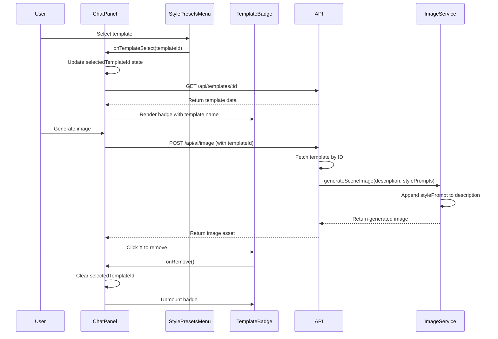

# Design Document: Template Style Badge Integration

## Overview

This feature integrates style template selection into the chat panel's visual interface and image generation pipeline. When users select a style template from the StylePresetsMenu, a badge will appear in the chat panel's bottom icon row, providing visual confirmation of the active style. The selected template's stylePrompt will automatically be applied to all image generation requests, ensuring consistent visual styling across generated content.

The implementation follows the existing architecture patterns:
- Feature-first organization within `src/features/chat/`
- Server-side AI gateway pattern for image generation
- Component state management for session-based persistence
- Consistent UI styling using the application's design system

## Architecture

### Component Hierarchy

```
ChatPanel (state owner)
├── StylePresetsMenu (template selection)
├── TemplateBadge (new component - visual indicator)
└── Image Generation Flow
    ├── Frontend: API call with templateId
    └── Backend: /api/ai/image endpoint
        └── geminiClient.generateSceneImage()
```

### Data Flow



## Components and Interfaces

### 1. TemplateBadge Component (New)

**Location:** `src/features/chat/components/TemplateBadge.tsx`

**Purpose:** Display the selected template as a removable badge in the chat panel's bottom icon row

**Props Interface:**
```typescript
interface TemplateBadgeProps {
  templateName: string;
  onRemove: () => void;
}
```

**Styling:**
- Use shaded pink color scheme matching active button styling
- Background: `bg-pink-500/20` (20% opacity pink)
- Border: `border-pink-500/40`
- Text: `text-pink-300`
- Hover state for X button: `hover:bg-pink-500/30`
- Rounded corners: `rounded-full`
- Padding: `px-3 py-1.5`
- Font size: `text-xs`

**Layout:**
- Positioned in the composer-bottom section
- Between the paintbrush (style templates) button and settings button
- Flexbox layout with gap spacing

### 2. ChatPanel Component (Modified)

**State Additions:**
```typescript
const [selectedTemplateId, setSelectedTemplateId] = useState<string | null>(null);
const [selectedTemplate, setSelectedTemplate] = useState<StyleTemplate | null>(null);
```

**New Methods:**

```typescript
// Fetch template details when templateId changes
useEffect(() => {
  if (selectedTemplateId) {
    fetchTemplateById(selectedTemplateId);
  } else {
    setSelectedTemplate(null);
  }
}, [selectedTemplateId]);

const fetchTemplateById = async (templateId: string) => {
  try {
    const response = await fetch(`/api/templates/${templateId}`);
    if (response.ok) {
      const data = await response.json();
      setSelectedTemplate(data.template);
    }
  } catch (error) {
    console.error('Failed to fetch template:', error);
    setSelectedTemplate(null);
  }
};

const handleTemplateRemove = () => {
  setSelectedTemplateId(null);
  setSelectedTemplate(null);
};
```

**Modified handleTemplateSelect:**
```typescript
const handleTemplateSelect = (templateId: string) => {
  // Toggle behavior: if same template selected, deselect it
  if (selectedTemplateId === templateId) {
    setSelectedTemplateId(null);
  } else {
    setSelectedTemplateId(templateId);
  }
};
```

**UI Changes:**
- Add TemplateBadge component in composer-bottom section
- Position between style templates button and settings button
- Conditional rendering based on selectedTemplate state

### 3. Image Generation API (Modified)

**Validation Schema Update:**

Modify `aiGenerateImageSchema` in `server/validation.ts`:
```typescript
export const aiGenerateImageSchema = z.object({
  projectId: z.string().min(1),
  sceneId: z.string().min(1),
  description: z.string().min(1),
  aspectRatio: z.enum(["16:9", "9:16", "1:1"] as const),
  stylePrompts: z.array(z.string()).default([]),
  templateId: z.string().optional(), // NEW FIELD
  imageModel: imageModelSchema,
  workflow: workflowSchema,
  thinkingMode: z.boolean().optional().default(false),
});
```

**Route Handler Update:**

Modify `/api/ai/image` endpoint in `server/routes/ai.ts`:
```typescript
router.post("/image", (req, res) => {
  void handle(req, res, "/api/ai/image", async (setMeta) => {
    const data: AiGenerateImagePayload = aiGenerateImageSchema.parse(req.body);
    
    // Fetch template if templateId provided
    let templateStylePrompt: string | undefined;
    if (data.templateId) {
      const template = getStyleTemplateById(db, data.templateId);
      if (template) {
        templateStylePrompt = template.stylePrompt;
      }
    }
    
    // Combine stylePrompts with template stylePrompt
    const allStylePrompts = templateStylePrompt 
      ? [...data.stylePrompts, templateStylePrompt]
      : data.stylePrompts;
    
    setMeta({
      projectId: data.projectId,
      geminiModel: data.imageModel,
      prompt: data.description,
      templateId: data.templateId,
    });

    requireProject(db, data.projectId);
    const scene = requireScene(db, data.projectId, data.sceneId);

    const image = await generateSceneImage(
      data.description,
      data.aspectRatio,
      allStylePrompts, // Use combined style prompts
      data.imageModel,
      data.workflow,
      data.thinkingMode
    );

    // ... rest of the handler remains the same
  });
});
```

### 4. Frontend API Client (Modified)

**Location:** Update the image generation API call in the component that triggers image generation

**Changes:**
- Include `templateId` in the request payload when calling `/api/ai/image`
- Pass `selectedTemplateId` from ChatPanel state to the generation function

## Data Models

### StyleTemplate (Existing)

```typescript
interface StyleTemplate {
  id: string;
  name: string;
  description: string;
  thumbnail?: string;
  category: string[];
  stylePrompt: string;  // This is applied to image generation
  tested: boolean;
  examples?: string[];
  metadata: {
    bestFor?: string[];
    avoid?: string[];
    recommendedWith?: string[];
  };
}
```

### Image Generation Request (Modified)

```typescript
interface ImageGenerationRequest {
  projectId: string;
  sceneId: string;
  description: string;
  aspectRatio: "16:9" | "9:16" | "1:1";
  stylePrompts: string[];
  templateId?: string;  // NEW: Optional template ID
  imageModel: string;
  workflow: string;
  thinkingMode?: boolean;
}
```

## Error Handling

### Template Fetch Failures

**Scenario:** Template ID is selected but fetch fails

**Handling:**
1. Log error to console
2. Set `selectedTemplate` to null
3. Do not display badge
4. Allow image generation to proceed without template styling
5. No user-facing error toast (graceful degradation)

### Invalid Template ID

**Scenario:** User has a templateId in state but template was deleted

**Handling:**
1. Backend returns null from `getStyleTemplateById`
2. Backend proceeds with image generation without template stylePrompt
3. Frontend receives successful response
4. No error shown to user

### Template Selection During Image Generation

**Scenario:** User changes template while image is generating

**Handling:**
1. Allow template change immediately
2. In-flight generation request uses the templateId from when it was initiated
3. Next generation request uses the new templateId
4. No cancellation of in-flight requests

## Testing Strategy

### Unit Tests

**TemplateBadge Component:**
- Renders with template name
- Calls onRemove when X button clicked
- Applies correct styling classes
- Handles long template names with text truncation

**ChatPanel Component:**
- Updates selectedTemplateId when template selected
- Fetches template data when templateId changes
- Clears template when badge removed
- Toggles template selection (select/deselect same template)
- Passes templateId to image generation API

### Integration Tests

**Image Generation Flow:**
- Image generated without template (baseline)
- Image generated with template includes stylePrompt
- Multiple stylePrompts combined correctly with template
- Template removal doesn't affect in-flight requests
- Invalid templateId handled gracefully

### Manual Testing Checklist

- [ ] Select template from StylePresetsMenu
- [ ] Badge appears in bottom icon row
- [ ] Badge displays correct template name
- [ ] Badge uses pink color scheme
- [ ] Click X removes badge
- [ ] Generate image with template selected
- [ ] Verify stylePrompt applied in generated image
- [ ] Select different template replaces badge
- [ ] Select same template deselects it
- [ ] Template persists across multiple generations
- [ ] Template clears on page refresh
- [ ] Badge responsive on mobile view
- [ ] Badge doesn't break layout with long names

## Implementation Notes

### CSS Styling

Add to existing CSS or component styles:

```css
.template-badge {
  display: inline-flex;
  align-items: center;
  gap: 0.5rem;
  padding: 0.375rem 0.75rem;
  background-color: rgba(236, 72, 153, 0.2); /* pink-500 with 20% opacity */
  border: 1px solid rgba(236, 72, 153, 0.4);
  border-radius: 9999px;
  font-size: 0.75rem;
  color: rgb(249, 168, 212); /* pink-300 */
  transition: background-color 0.2s;
}

.template-badge-remove {
  display: flex;
  align-items: center;
  justify-content: center;
  padding: 0.125rem;
  border-radius: 9999px;
  cursor: pointer;
  transition: background-color 0.2s;
}

.template-badge-remove:hover {
  background-color: rgba(236, 72, 153, 0.3);
}
```

### Accessibility

- Badge should have `role="status"` for screen readers
- Remove button should have `aria-label="Remove template"`
- Badge should announce template name when added
- Focus management: X button should be keyboard accessible

### Performance Considerations

- Template fetch is debounced by React's useEffect
- No polling or real-time updates needed
- Badge render is lightweight (single component)
- Template data cached in component state
- No impact on image generation performance

### Future Enhancements

1. **Multiple Template Selection:** Allow selecting multiple templates simultaneously
2. **Template Preview:** Show thumbnail in badge on hover
3. **Template Persistence:** Save to localStorage or project settings
4. **Template History:** Track recently used templates
5. **Template Recommendations:** Suggest templates based on workflow
